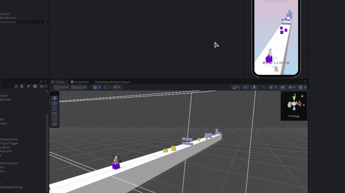

# Cube Collector

[Full Demo](https://youtu.be/pPi6AiqY0v0)

## My simple test case has been reworked with the VContainer and game architecture
Unity: [Input](https://docs.unity3d.com/Packages/com.unity.inputsystem@1.12/manual/index.html) / [Cinemachine](https://docs.unity3d.com/Packages/com.unity.cinemachine@3.1/manual/index.html) / [Ragdoll](https://docs.unity3d.com/Manual/wizard-RagdollWizard.html) / [Physics](https://docs.unity3d.com/Manual/PhysicsOverview.html) / [Animation](https://docs.unity3d.com/Manual/AnimationSection.html) / [Particle](https://learn.unity.com/tutorial/introduction-to-particle-systems#6025fdd9edbc2a112d4f0135) / [Scriptable Object](https://docs.unity3d.com/Manual/class-ScriptableObject.html) / [Editor Scripts](https://learn.unity.com/tutorial/editor-scripting#)

Plugins: [DOTween](https://dotween.demigiant.com/) / [VContainer](https://vcontainer.hadashikick.jp/) / [UniTask](https://github.com/Cysharp/UniTask) / [Vibration](https://github.com/BenoitFreslon/Vibration)

## Lifecycle Base
### Core
- [Core Scope (Project Context)](./Assets/Code/Core/DI/CoreScope.cs)
- [Bootstrap](./Assets/Code/Core/Bootstrap.cs)

### Level
- [Level Scope (Scene Context)](./Assets/Code/Level/LevelScope.cs)
- [Level Boot](./Assets/Code/Level/LevelBoot.cs)
- [Game Controller](./Assets/Code/Gameplay/GameController.cs)

### UI
- [UI Installer (On scene)](./Assets/Code/UI/UIInstaller.cs)
- [Screens](./Assets/Code/UI/Screens)
- [HUD](./Assets/Code/UI/HeadUpDisplay/HUD.cs)

### Entities
- [Player](./Assets/Code/PlayerLogic/Player.cs)
- [Cube](./Assets/Code/Gameplay/Cubes/Cube.cs)
- [Track](./Assets/Code/Gameplay/Tracks/Track.cs)

### Gameplay Systems
- Cubes 
- - [Cub Collection](./Assets/Code/Gameplay/Systems/CubeCollectionHandler.cs)
- - [Lost Cube](./Assets/Code/Gameplay/Systems/LostCubeHandler.cs)
- Tracks
- - [Track Flow](./Assets/Code/Gameplay/Systems/TrackFlow.cs)
- - [Track Spawner](./Assets/Code/Gameplay/Systems/TrackSpawner.cs)
- - [Track DeSpawner](./Assets/Code/Gameplay/Systems/TrackDeSpawner.cs)
- - [Track Cubes Spawner](./Assets/Code/Gameplay/Systems/TrackCubesSpawner.cs)